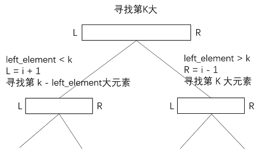
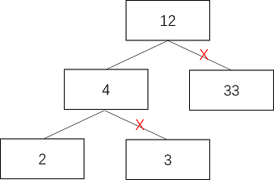
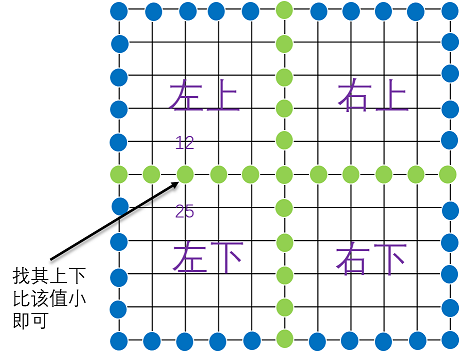
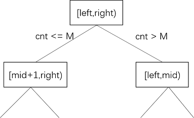
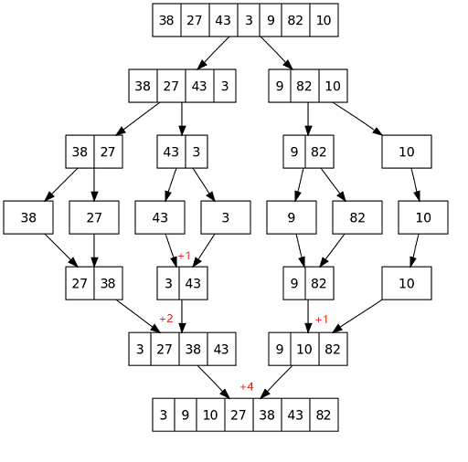

## 计算机算法设计与分析-作业1(Divide and Conquer)

几点说明：

- Author:   hrwhisper
- 用Python 3.5编写所有的代码
  - 没有写伪代码，虽然具体实现要比伪代码花费更多的时间，但是能通过生成随机数据进行测试来帮助检验算法的正确性。
- 每个代码最后一行为调用的示例
- 所有的代码以及测试代码均可在我的github上找到
  - 地址：https://github.com/hrwhisper/algorithm_course/tree/master/1_Divide_and_Conquer
  - 作业提交截止后上传，现在只是空目录。


## Problem 1.

> You are interested in analyzing some hard-to-obtain data from two separate databases. Each database contains n numerical values, so there are 2n values total and you may assume that no two values are the same. You’d like to determine the median of this set of 2n values, which we will define here to be the nth smallest value.
> However, the only way you can access these values is through queries to the databases. In a single query, you can specify a value k to one of the two databases, and the chosen database will return the kth smallest value that it contains. Since queries are expensive, you would like to compute the median using as few queries as possible.
> Give an algorithm that finds the median value using at most O(logn) queries.

### 思路与代码

这里将两个数据库的命名为A和B。

由于A和B的长度均为n，所以总共的长度为2n，本题定义的中位数位第n小的元素，而不是我们常见的求第(2n + 1) / 2的元素和第(2n + 1) / 2 + 1的元素的均值。

由于A和B能查询分别查询其第K个元素是什么（可以看成已经排好顺序的**数组**），因此，我们可以用二分的思想来解决此问题。

定义查询A和B中的第k小元素时，A的范围为[la,ra), B的搜索范围为[lb,rb) ，初始有la=lb=0,ra=rb=n。

对于每次查询，只需要在B中查找第lb + b_m(b_m= k / 2) 个元素，而在A中查询第la + a_m (a_m = k - b_m ) 个元素。我们假定数据库支持下标查询，且从0开始，于是有：

- 若A[la + a_m - 1] < B[lb + b_m - 1] (数组下标从0开始，所以-1)，说明第k个元素的范围应该在A中的[la + am,ra)和B中的[lb,lb+bm)之间查找第k-a_m个元素。
- 若A[la + a_m - 1] > B[lb + b_m - 1] ,说明第k个元素的范围应该在A中的[la ,la+a_m)和B中的[lb +b_m,rb)之间查找第k-b_m个元素。

根据上述思想，Python代码如下:

```python
def binary_search(A, la, ra, B, lb, rb, k):
    m, n = ra - la, rb - lb
    if n == 0: return A[la + k - 1]
    if k == 1: return min(A[la], B[lb])

    b_m = k >> 1
    a_m = k - b_m
    if A[la + a_m - 1] < B[lb + b_m - 1]:
        return binary_search(A, la + a_m, ra, B, lb, lb + b_m, k - a_m)
    else:  # A[la + a_m - 1] > B[lb + b_m - 1]
        return binary_search(A, la, la + a_m, B, lb + b_m, rb, k - b_m)


def find_median(A, B):
    return binary_search(A, 0, len(A), B, 0, len(A), ((len(A) << 1) + 1) >> 1)

# find_median(A, B) # A and B should be in sorted
```

### 子问题关系图

 

### 正确性证明

我们只需要证明寻找中间的元素过程无误即可。

我们的划分依据是（元素各不相同，无需考虑相等情况）:

1. A[la + a_m - 1] < B[lb + b_m - 1] 则缩小A的范围为[la + a_m,ra)，B的范围为[lb,lb+b_m)，在新范围查找k - am个元素
2. A[la + a_m - 1] > B[lb + b_m - 1] 则缩小B的范围为[lb +b_m,rb)，A的范围为[la ,la+a_m)，在新范围查找k - bm个元素

对于每一次，我们在B中查找第lb + k/2个元素b，而在A中查找第la  + k - k/2个元素a:

- 若 a < b，说明第k小的元素一定不在A的[la,la+a_m)中，也不在B的[lb+b_m,rb)中， 因此可以缩小范围。
- 若a > b，说明第k小的元素一定不在A的[la + am, ra)中，也不在B的[lb,lb +b_m)中， 因此可以缩小范围。

由于上述过程并不丢失解，因此该算法正确。

### 时间复杂度分析

由于每次将问题的规模减少1/2，因此有
$$
T(n) = T(n/2) + c
$$
因此复杂度为O(logn)

## Problem 2.

> Find the kth largest element in an unsorted array. Note that it is the kth largest element in the sorted order, not the kth distinct element.
> For example, Given [3, 2 ,1, 5, 6, 4] and k = 2, return 5.

### 思路与代码

本题目标是在无序的数组中寻找第k大的元素。我们可以借助快排划分函数的思想，对于每一次的划分[L,R]，我们选择A[L]作为枢纽元，若比A[L] 大，放在左边， 比A[L] 小，放在右边。

这样，可以该划分函数可以返回一个值i，这个值表示了[L,R]之间，A[i]此时的位置。

- 显然，A[i]左边元素有 i - L + 1 个 ，我们记为 left_element 
- 若left_element  == k 显然 A[i]就是要找的元素
- left_element <  k: 显然应该往右查找，变为查找[i+1,R] 中的第 k - left_element 个元素
- left_element >  k：显然结果在左边，查找[L,i - 1]中的第k个元素即可。

根据上述思想，Python代码如下:

```python
def find_kth_element(L, R, A, k):
    if L == R: return A[L]
    i = partition(L, R, A)
    left_element = i - L + 1
    if left_element == k: return A[i]
    if left_element < k:
        return find_kth_element(i + 1, R, A, k - left_element)
    else:
        return find_kth_element(L, i - 1, A, k)

def partition(L, R, A):
    i = L + 1
    j = R
    base = A[L]
    while True:
        while i < j and A[i] > base: i += 1
        while j > L and A[j] < base: j -= 1
        if i >= j: break
        A[i], A[j] = A[j], A[i]  # swap

    A[L], A[j] = A[j], A[L]  # swap
    return j

# print(find_kth_element(0, len(a) - 1, a, k))
```

### 子问题关系图

  

### 正确性证明

上述的过程中，我们利用快速排序的划分函数对数组进行划分，并根据划分后返回的下标i来进行区间缩小的依据。

A[i]左边元素有 left_element  = i - L + 1个，且左边的元素均比A[i]来得小，而右边的元素比A[i]来得大。

- 若left_element  == k 显然 A[i]就是要找的元素
- left_element <  k:  左边的元素不够K个，说明第K个元素在右边。变为查找[i+1,R] 中的第 k - left_element 个元素
- left_element >  k：左边元素比K个大，说明往左边查找。查找[L,i - 1]中的第k个元素即可。

由于上述过程并不丢失解，因此该算法正确。


### 时间复杂度分析

#### 最坏情况复杂度

该算法的复杂度取决于划分函数划分的好坏，与快速排序类似，最坏情况下，每次选择的都是数组中最大或者最小的元素，那么有
$$
T(n) <= T(n-1) + cn
$$
复杂度为O(n^2^)

#### 最好情况复杂度

在最好情况下,每次选择为中间的元素，那么有
$$
T(n) <= T(n/2) + cn
$$
复杂度为O(n)

#### 平均情况复杂度

在平均情况下，我们选择的一般不是最好也不是最差。和快速排序的平均复杂度证明类似，本算法也可以证明平均复杂度为O(n)

## Problem 3.
> Consider an n-node complete binary tree T, where n = 2^d^ − 1 for some d. Each node v of T is labeled with a real number x~v~. You may assume that the real numbers labeling the nodes are all distinct. A node v of T is a local minimum if the label x~v~ is less than the label x~w~ for all nodes w that are joined to v by an edge.
> You are given such a complete binary tree T, but the labeling is only specified in the following implicit way: for each node v, you can determine the value x~v~ by probing the node v. Show how to find a local minimum of T using only O(logn) probes to the nodes of T.

### 思路与代码

从根节点出发，

- 若它的两个子节点均大于它，那么返回根节点的值。
- 否则必然有一个子节点的值小于它，走该子节点即可。

首先定义树节点如下：

```python
class TreeNode(object):
    def __init__(self, x):
        self.val = x
        self.left = None
        self.right = None
```

下面是根据上述思想实现的代码

```python
def search_local_minimum(root):
    while root:
        if not root.left: return root.val
        if root.val > root.left.val:
            root = root.left
        elif root.val > root.right.val:
            root = root.right
        else:
            return root.val

# search_local_minimum(root)
```

### 子问题关系图

下面的图中，打X的说明不需要进行遍历。

  

### 正确性证明

在上述的过程中，我们往下遍历的条件为：子节点的值 < 当前节点的值。

因此，对于遍历到的任一节点来说，必然有其父节点（如果有的话）的值比该节点来的大，因此只需要继续查看其子节点即可。

在中途中，若出现两个子节点的值均大于该节点，那么已经找到局部最小值。

最坏的情况是遍历到叶子节点。由于其只与父节点有连边，并且该叶子节点值 < 父节点的值，因此为局部最小值。

### 复杂度分析

在正确性证明中已经提到，最坏的情况是遍历到子节点，因此其最大的次数为树的高度，即为O(logn)


## Problem 4.

> Suppose now that you’re given an n×n grid graph G. (An n×n grid graph is just the adjacency graph of an n×n chessboard. To be completely precise, it is a graph whose node set is the set of all ordered pairs of natural numbers (i,j), where i <= n and j <=n ; the nodes (i,j) and (k,l) are joined by an edge if and only if |i − k| + |j − l| = 1.)
> We use some of the terminology of PROBLEM 4. Again, each node v is labeled by a real number x~v~ ; you may assume that all these labels are **distinct**. Show how to find a local minimum of G using only O(n) probes to the nodes of G. (Note that G has n^2^ nodes.)

### 思路与代码

用分治法解此题，主要是找到必然包含局部最小值的位置，然后缩小查找范围。

为了方便说明，将图标记为蓝色、绿色，分别表示一个区域的边界、两个区域（或者四个区域）的交界。

​    

我们每次从上图中蓝色、绿色所有的点进行比较，找到其最小值，记录其下标为min_x,min_y。

(min_x,min_y)可能有如下的颜色：

- 蓝色，则说明局部最小值即为该区域，则下次搜索该区域即可。
- 绿色，则需要比较其上下左右四个点（如果有的话）中的点，有如下情况：
  - 该点四周的点比较大，说明该点为局部最小值
  - 该点四周某个点比较小，则下次搜索区域为该点所在的区域，若存在多个点，也只需要搜索任一一个小的点所在区域即可。


```python
def search_local_minimum(sx, sy, ex, ey, g):
    if sx == ex and sy == ey:
        return sx, sy
    elif ex - sx == 1 and ey - sy == 1:
        temp = [g[sx][sy], g[sx + 1][sy], g[sx][sy + 1], g[sx + 1][sy + 1]]
        return [(sx, sy), (sx + 1, sy), (sx, sy + 1), (sx + 1, sy + 1)][temp.index(min(temp))]

    mx, my = (sx + ex) >> 1, (sy + ey) >> 1
    min_x, min_y = mx, my
    for i in range(sx, ex + 1):
        if g[min_x][min_y] > g[i][sy]: min_x, min_y = i, sy
        if g[min_x][min_y] > g[i][ey]: min_x, min_y = i, ey
        if g[min_x][min_y] > g[i][my]: min_x, min_y = i, my

    for i in range(sy, ey + 1):
        if g[min_x][min_y] > g[sx][i]: min_x, min_y = sx, i
        if g[min_x][min_y] > g[ex][i]: min_x, min_y = ex, i
        if g[min_x][min_y] > g[mx][i]: min_x, min_y = mx, i

    if min_x < mx and min_y < my:  # 左上角
        case = 0
    elif min_x > mx and min_y < my:  # 左下角
        case = 1
    elif min_x < mx and min_y > my:  # 右上角
        case = 2
    elif min_x > mx and min_y > my:  # 右下角
        case = 3
    else:
        if min_x > sx and g[min_x - 1][min_y] < g[min_x][min_y]:
            case = 0 if min_y < my else 2  # 上半部分 区分左上右上
        elif min_x < ex and g[min_x + 1][min_y] < g[min_x][min_y]:
            case = 1 if min_y < my else 3  # 下半部分 区分左下右下
        elif min_y > sy and g[min_x][min_y - 1] < g[min_x][min_y]:
            case = 0 if min_x < mx else 1  # 左半部分 区分左上左下
        elif min_y < ey and g[min_x][min_y + 1] < g[min_x][min_y]:
            case = 2 if min_x < mx else 3  # 右半部分 区分右上右下
        else:
            return min_x, min_y

    if case == 0:
        return search_local_minimum(sx, sy, mx, my, g)
    elif case == 1:
        return search_local_minimum(mx, sy, ex, my, g)
    elif case == 2:
        return search_local_minimum(sx, my, mx, ey, g)
    else:
        return search_local_minimum(mx, my, ex, ey, g)

def solve_search_local_minimum(g):
    x, y = search_local_minimum(0, 0, len(g) - 1, len(g) - 1, g)
    return g[x][y]

# solve_search_local_minimum(g)
```

### 子问题关系图

见思路与代码中的图，每次将其范围缩小为左上、右上、左下、右下中的一个。

### 正确性证明

在上述的算法中，我们首先比较了所有蓝色和绿色的点，并标记了最小值的坐标min_x,min_y。

由于各个点的值都不相同，因此，该点必然小于其它蓝色、绿色的点。

回顾一下我们的过程，若该点的颜色如下：

- 蓝色，下次搜索该点所在的区域。
- 绿色，则需要比较其上下左右四个点（如果有的话）中的点，有如下情况：
  - 该点四周的点比较大，说明该点为局部最小值
  - 该点四周某个点比较小，则下次搜索区域为该点所在的区域，若存在多个点，也只需要搜索任一一个小的点所在区域。

证明该算法的正确性关键在于证明对于蓝色和绿色点处理的正确性。

#### 1. 蓝色的点正确性

若该点（下面记为点a）为蓝色的点，那么，我们的做法是下一次直接搜索该点所在的区域area。

若从该点a出发，对area进行遍历，遍历的方法是每次取比当前点的值val **小**的元素，那么遍历一定会终止。

因为val不断的缩小，而我们知道，area的最外围的一定大于val。 因此遍历一定终止，而终止的时候val为局部最小值。

因此对于蓝色的点，该点所在的area中必然有局部最小值，因此对于蓝色点处理正确。

#### 2. 绿色点的正确性

绿色点处理的正确性证明如下：

1. 若四周的点比该点大，说明为局部最小值，返回该点即可。这个显然正确。
2. 若该点四周的某个点b比该点小，则下次为这个点所在的区域area。原理和蓝色的点类似，若从b出发，对area进行遍历，遍历的方法是每次取比当前点的值val **小**的元素，那么遍历一定会终止。因为area最外围边界的点均会大于遍历时不断缩小的val。 终止时val为局部最小值。因此这样能保证有局部最小值。

综合1和2对于蓝色、绿色点的处理正确性证明，该算法正确。

### 复杂度分析

上述的算法中，每次将划分为1个子问题，每个子问题是原来的1/4，而每次比较的为6n，有如下递归式：
$$
T(n)  = T(n/4) +cn
$$
因此复杂度为O(n)

## Problem 5. 

> every year the cows hold an event featuring a peculiar version of hopscotch that involves carefully jumping from rock to rock in a river. The excitement takes place on a long, straight river with a rock at the start and another rock at the end, L units away from the start (1 ≤ L ≤ 1,000,000,000). Along the river between the starting and ending rocks, N (0 ≤ N ≤ 50,000) more rocks appear, each at an integral distance Di from the start (0 < Di < L).
> To play the game, each cow in turn starts at the starting rock and tries to reach the finish at the ending rock, jumping only from rock to rock. Of course, less agile cows never make it to the final rock, ending up instead in the river.
> Farmer John is proud of his cows and watches this event each year. But as time goes by, he tires of watching the timid cows of the other farmers limp across the short distances between rocks placed too closely together. He plans to remove several rocks in order to increase the shortest distance a cow will have to jump to reach the end. He knows he cannot remove the starting and ending rocks, but he calculates that he has enough resources to remove up to M rocks (0 ≤ M ≤ N).
> Farmer John wants to know exactly how much he can increase the shortest distance before he starts removing the rocks. Help Farmer John determine the greatest possible shortest distance a cow has to jump after removing the optimal set of M rocks. In other words, you need help John to find a way to remove M blocks, so that in the rest of the blocks, the distance between two adjacent blocks which have a minimum spacing is the largest.

### 思路与代码

题目给定了到L,M,N分别表示到河岸的距离，移除M个石头，原来有N个石头,以及各个石头到初始点的距离rocks。

首先将初始点0和终点L看成不能删掉的两个石头，将它们添加进rocks数组，然后对rocks排序。我们知道，在移除M个石头之后，最小距离d 必定满足
$$
min(rocks[i] - rocks[i-1] , i ∈ [1,N + 1]) < = d <= L
$$
因此，我们可以用二分的方法猜测该最小距离。设当前的范围[left,right)。 每次我们查看 left 和 right的中点mid，该mid就是我们猜测的最小的距离的最大值，然后对rocks中，间距**不大于**mid的进行计数（这些就是要删除的点），记为cnt。

- cnt > M: 说明该mid值太大了，需要减小，区间变为 [left,mid)
- cnt < M: 说明mid太小，区间变为 [mid+1,right)
- cnt == M: 说明恰好去除了M个，但是，删除掉这M个后，长度一定比mid大，因此区间变为 [mid+1,right)

根据上述思想，Python代码如下：

```python
def count_small_than_mid(rocks, mid, n):
    start = cnt = 0
    for i in range(1, n):
        if rocks[i] - rocks[start] <= mid:
            cnt += 1
        else:
            start = i
    return cnt

def binary_search(left, right, rocks, M, N):
    while left < right:
        mid = (left + right) >> 1
        if count_small_than_mid(rocks, mid, N) <= M:
            left = mid + 1
        else:
            right = mid
    return left

def solve_largest_minimum_spacing(L, M, N, rocks):
    rocks = [0] + rocks + [L]
    N += 2
    rocks.sort()
    left = min(rocks[i] - rocks[i - 1] for i in range(1, N)) # left start with 0 is ok.
    return binary_search(left, L + 1, rocks, M, N)

# solve_largest_minimum_spacing(L, M, N, rocks)
```

### 子问题关系图

   

### 正确性证明

上述的做法中，用二分法猜测最小距离的最大值，来不断的逼近正确的解。

对于每一次的二分范围，[left,right)。mid 为其中点，也是我们的猜测值，我们遍历rocks数组，若石头间的间距比mid小，说明我们要把这个石头删除掉，来扩大最小值。记小于等于mid的共有cnt个，于是有：

- cnt > M: 我们需要删除多于M个石头来达到mid，说明该mid值太大了，需要减小区间上界，区间变为 [left,mid)
- cnt < M: 说明还没有删除M个石头就可以达到mid，就是说mid太小，区间变为 [mid+1,right)
- cnt == M: 说明恰好去除了M个，但是，删除掉这M个后，长度一定比mid大，因此区间变为 [mid+1,right)

通过不断的二分缩小范围，最后一定能找到真正的最大的最小间距。

### 复杂度分析

首先进行排序，复杂度O(NlogN)，接着对L进行二分，每次过程需要O(N)，因此复杂度为O(NlogL)

一般来说，有L > N, 总复杂度为O(NlogL)

## Problem 6.

> Recall the problem of finding the number of inversions. As in the course, we are given a sequence of n numbers a1,··· ,an, which we assume are all distinct, and we difine an inversion to be a pair i < j such that ai > aj.
> We motivated the problem of counting inversions as a good measure of how different two orderings are. However, one might feel that this measure is too sensitive. Let’s call a pair a significant inversion if i < j and ai > 3a~j~. Given an O(nlogn) algorithm to count the number of significant inversions between two orderings.

### 思路与代码

本题目的提出了新的逆序数定义，要求 i < j 并且 a[i] > 3a[j]，不能像原来的合并排序一样，简单的在合并的时候a[i] > a[j] ，然后累计下标之差。因为可能a[i] > a[j]但是 a[i] <= 3a[j]。

因此，单独的一个新的过程，对于左右两个已经有序的数组，我们只需要O(n)即可求出解。

- 若a[i] <= 3*a[j] : i++
- 否则a[i] > 3*a[j]:  说明此时满足条件，cnt += n - i , 最后j++

代码如下：

```python
def merge_sort(L, R, a):
    if L >= R - 1: return 0
    mid = (L + R) >> 1
    cnt_left = merge_sort(L, mid, a)
    cnt_right = merge_sort(mid, R, a)
    return cnt_left + cnt_right + merge(L, mid, R, a)

def _count_by_merge(i, n, j, m, a):
    cnt = 0
    while i < n and j < m:
        if a[i] <= 3 * a[j]:
            i += 1
        else:
            cnt += n - i
            j += 1
    return cnt

def merge(L, le, R, a):
    rs = le
    ls = L
    x = []

    cnt = _count_by_merge(ls, le, rs, R, a)

    while ls < le and rs < R:
        if a[ls] <= a[rs]:
            x.append(a[ls])
            ls += 1
        else:
            x.append(a[rs])
            rs += 1

    for ls in range(ls, le):
        x.append(a[ls])
    for rs in range(rs, R):
        x.append(a[rs])
    for i in range(L, R):
        a[i] = x[i - L]
    return cnt

# merge_sort(0, len(A), A)
```

### 子问题关系图

和合并排序类似，过程如下：（在合并过程中进行计数已经用红色的数字标识出来。）

 

### 正确性证明

该算法在合并排序的基础上，添加了一个_count_by_merge的过程，来遍历两个子数组，用来求解significant inversion的个数。

由于两个子数组已经排好序，因此可以用双指针的思想来找到a[i] >3* a[j] 的分界点。对于a[i] <= 3a[j]，显然a[i] <= 3*a[j+1....]，因此使用双指针不会丢失解，该算法是正确的。

### 复杂度分析

本解法在合并排序的合并过程中增加了一个过程来统计逆序数的个数，其和合并过程复杂度一样，都为O(n), 仍然有如下递归表达式：

$$
T(n) = 2T(n/2) + cn
$$
因此总复杂度仍为O(nlogn)


## Problem 7.

> A group of n Ghostbusters is battling n ghosts. Each Ghostbuster is armed with a proton
> pack, which shoots a stream at a ghost, eradicating it. A stream goes in a straight line and terminates when it hits the ghost. The Ghostbusters decide upon the following strategy. They will pair off with the ghosts, forming n Ghostbuster-ghost pairs, and then simultaneously each Ghostbuster will shoot a stream at his chosen ghost. As we all know, it is very dangerous to let streams cross, and so the Ghostbusters must choose pairings for which no streams will cross. Assume that the position of each Ghostbuster and each ghost is a fixed point in the plane and that no three positions are collinear.
>
> 1. Argue that there exists a line passing through one Ghostbuster and one ghost such the number of Ghostbusters on one side of the line equals the number of ghosts on the same side. Describe how to nd such a line in O(n log n) time.
> 2. Give an O(n^2^ log n)-time algorithm to pair Ghostbusters with ghosts in such a way that no streams cross.

### 1

我们记Ghostbusters 为平面上红色的点，ghost为平面上黑色的点。

我们首先证明，给定平面上的点，我们能找到一条经过红色和黑色的点，使得在该直线的一侧有等数量的红色点和黑色点。

平面上有n个红点和n个黑点。找到所有2n个点中纵坐标y最小的点。若有两个（因为没有三点共线）点y相同取横坐标x较小的那一个点，记录该点为点A，设A为红色的点（黑色同理，这里以红色为例）。以A点向其余所有的点连线，计算与x轴正向的夹角(  [1,0] )，然后按照夹角排序。这样，从x轴正向出发，按照夹角的大小扫描点，初始设置cnt_b = cnt_r=0（黑色和红色的点的个数为0），若当前点是红色，那么cnt_r ++ ,若为黑色，则查看cnt_b 是否等于cnt_r，若相等，该点就是我们要找的分界点。否则cnt_b ++.

由于进行排序，所以复杂度为O(nlogn)

### 2

每一次调用方法一的划分，然后分成两边，对每一边递归即可。

由于每次配对1个，并进行一次排序，因此
$$
T(n) = T(n-1) + nlog(n)
$$
因此复杂度为n^2^logn


## Problem 8.

> The attachedfile Q5.txt contains 100,000 integers between 1 and 100,000 (each row has asingle integer), the order of these integers is random and no integer is repeated.
>
> 1.    Write a program to implement the Sort-and-Count algorithms in yourfavorite language, find the number of inversions in the given file.
> 2.    In the lecture, we count the number of inversions in O(n log n)time, using the Merge-Sort idea. Is it possible to use the Quick-Sort ideainstead ?If possible, implement the algorithm inyour favourite language, run it over the given file, and compare its runningtime with the one above. If not, give a explanation.

### 1.合并排序

```python
def merge_sort(L, R, a):
    if L >= R - 1: return 0
    mid = (L + R) >> 1
    cnt = merge_sort(L, mid, a)
    cnt += merge_sort(mid, R, a)
    return cnt + merge(L, mid, R, a)

def merge(L, le, R, a):
    cnt = 0
    rs = le
    ls = L
    x = []
    while ls < le and rs < R:
        if a[ls] <= a[rs]:
            x.append(a[ls])
            ls += 1
        else:
            x.append(a[rs])
            rs += 1
            cnt += le - ls
    while ls < le:
        x.append(a[ls])
        ls += 1
    while rs < R:
        x.append(a[rs])
        rs += 1

    for i in range(L, R):
        a[i] = x[i - L]
    return cnt
    
# cnt = merge_sort(0, len(A), A)
```

### 2.快速排序

可以用快速排序来完成，需要注意的是，每次划分不再是简单的交换左右两边，而是要分别遍历来保证有序。

在下面的划分函数中，使用了辅助数组t，首先处理小于a[L]的情况, 不断的将小于a[L]的元素放进t中，而这些会构成的逆序数个数为 i - L - len(t)，就是说 和t的长度的差值说明之前有i - L - len(t)个元素不小于a[L]，而当前的元素a[i] < a[L]，因此逆序数个数应该加上i - L - len(t)个。

下面为代码：

```python
def quick_sort(L, R, a):
    if L >= R: return 0
    i, cnt = partition(L, R, a)
    cnt += quick_sort(L, i - 1, a)
    cnt += quick_sort(i + 1, R, a)
    return cnt

def partition(L, R, a):
    cnt = 0
    t = []
    base = a[L]
    i = L + 1
    while i <= R:
        if a[i] < base:
            cnt += i - L - len(t)
            t.append(a[i])
        i += 1
    j = len(t) + L
    t.append(base)  # or delete this line, and let i = L
    i = L + 1
    while i <= R:
        if base <= a[i]:
            t.append(a[i])
        i += 1

    for i in range(L, R + 1):
        a[i] = t[i - L]

    return j, cnt
    
# cnt = quick_sort(0, len(A) - 1, A)
```

### 测试输入与结果

读入Q8.txt的数据以及时间测试结果的代码为：

```python
if __name__ == '__main__':
    from datetime import datetime

    with open('./Q8.txt') as f:
        a = list(map(int, f.read().split()))
    start = datetime.now()
    print(merge_sort(0, len(a), a[:]))
    print('complete merge sort in {}s'.format((datetime.now() - start).total_seconds()))
    start = datetime.now()
    print(quick_sort(0, len(a) - 1, a))
    print('complete quick sort in {}s'.format((datetime.now() - start).total_seconds()))
```

上述程序输出：

```
2500572073
complete merge sort in 1.207803s
2500572073
complete quick sort in 1.722145s
```


## Problem 9.

> Implement the algorithm for the closest pair problem in your favourite language.
> INPUT: Given n points in a plane.
> OUTPUT: the pair with the least Euclidean distance.

首先定义欧式距离：

```python
def euclidean_dis_pow(a, b):
    return math.sqrt((a[0] - b[0]) ** 2 + (a[1] - b[1]) ** 2)
```

**这里假设两点的欧式距离不大于int最大值（0x7fffffff）**

O(nlogn^2^)的算法实现如下：

```python
def solve_closest_pair_n_logn2(points):
    def closest_pair(L, R, points):
        if L == R: return 0x7fffffff, points[L], points[R]  # return int max
        if R - L == 1: return euclidean_dis_pow(points[L], points[R]), points[L], points[R]
        mid = (L + R) >> 1
        d, p1, p2 = closest_pair(L, mid, points)
        d2, p3, p4 = closest_pair(mid + 1, R, points)
        if d > d2:
            d, p1, p2 = d2, p3, p4

        min_x = points[mid][0] - d
        max_x = points[mid][0] + d

        suspect = [points[i] for i in range(L, R + 1) if min_x <= points[i][0] <= max_x]

        suspect.sort(key=lambda x: x[1])
        n = len(suspect)
        for i in range(n):
            for j in range(i + 1, n):
                if suspect[j][1] - suspect[i][1] > d: break
                t = euclidean_dis_pow(suspect[i], suspect[j])
                if t < d:
                    d = t
                    p1, p2 = suspect[i], suspect[j]
        return d, p1, p2

    points.sort(key=cmp_to_key(lambda x, y: x[0] - y[0] if x[0] != y[0] else x[1] - y[1]))
    return closest_pair(0, len(points) - 1, points)
    
# d,p1,p2 = solve_closest_pair_n_logn2(points)
```

根据合并排序的思想，可将上述的提升到O(nlogn)

```python
def solve_closest_pair_n_logn(points):
    def merge(ls, le, re, a):
        start = ls
        rs = le + 1
        b = []
        while ls <= le and rs <= re:
            if a[ls][1] < a[rs][1]:
                b.append(a[ls])
                ls += 1
            else:
                b.append(a[rs])
                rs += 1

        for i in range(ls, le + 1):
            b.append(a[i])
        for i in range(rs, re + 1):
            b.append(a[i])
        for i in range(start, re + 1):
            a[i] = b[i - start]

    def closest_pair(L, R, points, y_sorted):
        if L == R: return 0x7fffffff, points[L], points[R]  # return int max
        if R - L == 1:
            if y_sorted[L][1] > y_sorted[R][1]:
                y_sorted[L], y_sorted[R] = y_sorted[R], y_sorted[L]
            return euclidean_dis_pow(points[L], points[R]), points[L], points[R]
        mid = (L + R) >> 1
        d, p1, p2 = closest_pair(L, mid, points, y_sorted)
        d2, p3, p4 = closest_pair(mid + 1, R, points, y_sorted)
        merge(L, mid, R, y_sorted)
        if d > d2:
            d, p1, p2 = d2, p3, p4

        min_x = points[mid][0] - d
        max_x = points[mid][0] + d

        suspect = [y_sorted[i] for i in range(L, R + 1) if min_x <= y_sorted[i][0] <= max_x]
        n = len(suspect)
        for i in range(n):
            for j in range(i + 1, n):
                if suspect[j][1] - suspect[i][1] > d: break
                t = euclidean_dis_pow(suspect[i], suspect[j])
                if t < d:
                    d = t
                    p1, p2 = suspect[i], suspect[j]
        return d, p1, p2

    points.sort(key=cmp_to_key(lambda x, y: x[0] - y[0] if x[0] != y[0] else x[1] - y[1]))
    y_sorted = points[:]
    return closest_pair(0, len(points) - 1, points, y_sorted)
    
# d,p1,p2 = solve_closest_pair_n_logn2(points)
```

## Problem 10.

> Implement the Strassen algorithm algorithm for MatrixMultiplication problem in your favourite language, and compare the performance with grade-school method.

首先定义矩阵的加法、减法和小学生乘法。

```python
def matrix_brute_mul(A, B):
    n = len(A)
    C = [[0 for _ in range(n)] for _ in range(n)]
    for i in range(n):
        for j in range(n):
            for k in range(n):
                C[i][j] += A[i][k] * B[k][j]
    return C

def matrix_add_or_sub(A, B, add=True):
    n = len(A)
    return [[A[i][j] + B[i][j] if add else A[i][j] - B[i][j] for j in range(n)] for i in range(n)]
```

接下来是strassen的矩阵乘法。

为了能处理奇数的情况，这里将其扩展为2的整次幂，不够的补0。这样，在分治过程中，一定能保证矩阵能刚好被划分。

具体的做法是求大于等于当前的维度的最小2的整次幂，即
$$
2^{ ceil(log_{n}2)}
$$
其中，ceil是向上取整。

```python
from math import ceil, log
def strassen_matrix_mul(A, B):
    before_n = len(A)
    n = 2 ** ceil(log(before_n, 2))
    for i in range(before_n):
        A[i].extend([0] * (n - before_n))
        B[i].extend([0] * (n - before_n))
    for i in range(before_n, n):
        A.append([0] * n)
        B.append([0] * n)
    C = _strassen_mul(A, B)[:before_n]
    return [row[:before_n] for row in C]
```

接下来是strassen矩阵乘法核心的分治过程：

```python
def _strassen_mul(A, B):
    n = len(A)
    if n == 1: return [[A[0][0] * B[0][0]]]
    if n == 2: matrix_brute_mul(A, B)
    half_n = n >> 1
    A11, A12, A21, A22 = [], [], [], []
    B11, B12, B21, B22 = [], [], [], []
    for i in range(half_n):
        A11.append(A[i][:half_n][:])
        A12.append(A[i][half_n:][:])
        B11.append(B[i][:half_n][:])
        B12.append(B[i][half_n:][:])
        A21.append(A[i + half_n][:half_n][:])
        A22.append(A[i + half_n][half_n:][:])
        B21.append(B[i + half_n][:half_n][:])
        B22.append(B[i + half_n][half_n:][:])

    P1 = _strassen_mul(A11, matrix_add_or_sub(B12, B22, False))
    P2 = _strassen_mul(matrix_add_or_sub(A11, A12), B22)
    P3 = _strassen_mul(matrix_add_or_sub(A21, A22), B11)
    P4 = _strassen_mul(A22, matrix_add_or_sub(B21, B11, False))
    P5 = _strassen_mul(matrix_add_or_sub(A11, A22), matrix_add_or_sub(B11, B22))
    P6 = _strassen_mul(matrix_add_or_sub(A12, A22, False), matrix_add_or_sub(B21, B22))
    P7 = _strassen_mul(matrix_add_or_sub(A11, A21, False), matrix_add_or_sub(B11, B12))

    C11 = matrix_add_or_sub(matrix_add_or_sub(matrix_add_or_sub(P4, P5), P6), P2, False)
    C12 = matrix_add_or_sub(P1, P2)
    C21 = matrix_add_or_sub(P3, P4)
    C22 = matrix_add_or_sub(matrix_add_or_sub(matrix_add_or_sub(P1, P5), P3, False), P7, False)

    C = [[] for _ in range(n)]
    for i in range(half_n):
        C[i].extend(C11[i])
        C[i].extend(C12[i])
        C[i + half_n].extend(C21[i])
        C[i + half_n].extend(C22[i])
    return C

# C = strassen_matrix_mul(A, B)
```

对比小学生矩阵乘法，比较代码如下：

```python
if __name__ == '__main__':
    from datetime import datetime
    import random

    n = 64
    A, B = [], []
    for i in range(n):
        A.append([random.randint(0, n ** 2) for _ in range(n)])
        B.append([random.randint(0, n ** 2) for _ in range(n)])

    start = datetime.now()
    matrix_brute_mul(A, B)
    print('complete grade-school method in {}s'.format((datetime.now() - start).total_seconds()))

    start = datetime.now()
    strassen_matrix_mul(A[:], B[:])
    print('complete Strassen method in {}s'.format((datetime.now() - start).total_seconds()))
```

上面的测试结果为：

```
complete grade-school method in 0.101565s
complete Strassen method in 1.840224s
```

反而不如小学生矩阵，我感觉是因为python动态类型+函数调用引起的。

## Problem 11.

>Implement the Karatsuba algorithm for Multiplication problem in your favourite language, and compare the performance with quadratic grade-school method.

```python
def quick_mul(x, y):
    s_x, s_y = str(x), str(y)
    if len(s_x) == 1 or len(s_y) == 1: return x * y
    n = max(len(s_x), len(s_y))
    half_n = n >> 1
    pow_half_n = 10 ** half_n
    xh = x // pow_half_n
    xl = x % pow_half_n
    yh = y // pow_half_n
    yl = y % pow_half_n
    p = quick_mul(xh + xl, yh + yl)
    h = quick_mul(xh, yh)
    l = quick_mul(xl, yl)
    if n & 1: n -= 1
    return h * (10 ** n) + (p - h - l) * (10 ** half_n) + l

# quick_mul(x,y)
```