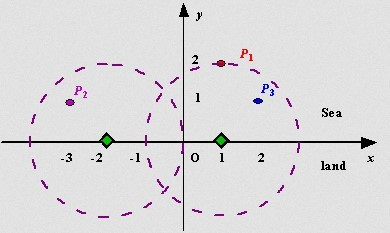

# 计算机算法设计与分析-作业3(Greedy)

- Author: hrwhipser
- https://github.com/hrwhisper/algorithm_course/


## 说明

- 采用python 3.5.2编写了所有的代码
- 在作业提交期限截止后，所有的代码可以在如下网址找到:
  - https://github.com/hrwhisper/algorithm_course


## Problem 1.

> Given a list of n natural numbers d~1~, d~2~,...,d~n~ , show how to decide in polynomial time whether there exists an undirected graph G = (V, E) whose node degrees are precisely the numbers  d~1~, d~2~,...,d~n~. G should not contain multiple edges between the same pair of nodes, or “ loop” edges with both endpoints equal to the same node.

### 思路

题目给定了n个度，让我们判断是否能形成一个没有两条边连接相同节点且每个边都连接两个节点的图（就是简单图）

首先，判断满足如下条件：

- 度数和为偶数 （对于无向图，每条边贡献两个度，因此度数和必为偶数）
- 总边数不超过 $ \frac{n*(n-1)}{2} $ 在（完全的简单图，**最大度不超过n-1**）

接着，我们每次排序（逆序），首先把最大的度数（设为k）安排出去，看看是否足够多的点（k个）来满足它需要的边（就是从前往后扫，每个度－1）。如果不够，说明只能安排重边，即不能构成简单图。

其实也是**Havel**定理的运用。

### 代码

```python
def can_be_a_graph(degrees):
    d_sum, n = sum(degrees), len(degrees)
    if d_sum & 1 or n * (n - 1) < d_sum or max(degrees) > n - 1: return False
    for n in range(n, -1, -1):
        degrees.sort(reverse=True)
        for i in range(1, n):
            if degrees[0] <= 0: break
            degrees[i] -= 1
            if degrees[i] < 0: return False
            degrees[0] -= 1
        if degrees[0] != 0: return False
    return True
```

### 正确性证明

如果给定的n个节点的度能构成简单图，那么必然满足上面的两个判断条件。

紧接着，我们每次排序（逆序），如果能构成简单的图，度数最大的点x（设度数为k）必然可以从其他较大的k个节点中连接一条边，因此如果有k个节点，那么不会有重边出现，这个点可以安排，如果不满足k个节点，显然不能构成简单图。

### 时间复杂度分析

上述的做法，每次进行排序，每次排序复杂度为O(nlogn)，一共有n次排序，因此复杂度O(n^2^logn)

## Problem 2.

> There are n distinct jobs, labeled J~1~, J~2~,···,J~n~, which can be performed completely independently of one another. Each jop consists of two stages: first it needs to be preprocessed on the supercomputer, and then it needs to be finished on one of the PCs. Let’s say that job J~i~ needs p~i~ seconds of time on the supercomputer, followed by f~i~ seconds of time on a PC. Since there are at least n PCs available on the premises, the finishing of the jobs can be performed on PCs at the same time. However, the supercomputer can only work on a single job a time without any interruption. For every job, as soon as the preprocessing is done on the supercomputer, it can be handed off to a PC for finishing.
>
> Let’s say that a schedule is an ordering of the jobs for the supercomputer, and the completion time of the schedule is the earlist time at which all jobs have finished processing on the PCs. Give a polynomial-time algorithm that finds a schedule with as small a completion time as possible.

### 思路

我们采用贪心的思想，为了尽可能的节约总时间，我们把f~i~大的先运行，让其尽早的并行处理。

### 代码

```python
def min_complete_time(p, f):
    n = len(p)
    t = list(zip(range(n), list(zip(p, f))))  # it will be like this: [_id,(pi,fi)]
    t.sort(key=cmp_to_key(lambda x, y: y[1][1] - x[1][1]))
    order = []
    min_time = timecost = 0
    for i in range(n):
        order.append(t[i][0])
        timecost += t[i][1][0]
        min_time = max(min_time, timecost + t[i][1][1])
    return min_time, order
```

### 正确性证明

假设已知有最佳的任务处理序列 j~a~,j~b~,j~c~…j~k~,j~i~ ,… , 对于相邻的任务j~i~和j~k~有：任务j~i~在PC上的时间f~i~大于j~k~ 在PC上的时间f~k~，但是j~k~在最佳序列中排在j~i~前面。

对于运行到任务j~k~，设pte为在任务j~k~之前，在supercomputer上运行的总时间，fte为当前运行的总时间，显然，运行j~k~，j~i~有：

```
pte += p[k]
fte_k_i_1 = fte = max(fte,pte+f[k])
pte += p[i]
fte_k_i = fte = max(fte,pte+f[i])
```

而如果我们交换任务k和任务i的顺序，那么有：

```
pte += p[i]
fte_i_k_1 = fte = max(fte,pte+f[i])
pte += p[k]
fte_i_k = fte = max(fte,pte+f[k])
```

显然，最后的pte是相同的，那么fte是哪个比较大？

由于f[i] > f[k],那么有fte_k\_i > fte_k\_i\_1（因为f[i] > f[k]并且pte变大了）

而 fte_i_k >= fte\_i\_k\_1（pte变大，但是f[k] < f[i]），也就是说，交换i和k不会增大fte的值。

因此，我们的贪心算法是正确的。

### 时间复杂度分析

上述的算法进行了排序，复杂度O(nlogn)，然后扫描一遍O(n)，因此总复杂度O(nlogn)

## Problem 3.

> Assume the coasting is an infinite straight line. Land is in one side of coasting, sea in theother. Each small island is a point locating in the sea side. And any radar installation, locating on the coasting, can only cover d distance, so an islandin the sea can be covered by a radius installation, if the distance between them is at most d.
>
> We use Cartesian coordinate system, defining the coasting is the x-axis. The seaside is above x-axis, and the land side below. Given the position of each island in the sea, and given the distance of the coverage of the radar installation, your task is to write a program to find the minimal number ofradar installations to cover all the islands. Note that the position of an island is represented by its x-y coordinates.
>
>  

### 思路

如果某个岛屿的纵坐标大于d，那么肯定无解。

在放置雷达的过程中，先按照横坐标进行排序，每次我们尽量的向右放置，对于一个点i，我们尝试其是否在之前的雷达范围内，如果在则扫描下一个。如果不在，则看该点支持放置的最右边的雷达的横坐标cx是多少，若小于等于之前的雷达横坐标px，则px=cx，把之前的雷达进行左移即可，否则说明需要一个新的雷达才可以覆盖到，而新的雷达放置点为cx。

如图，一开始我们将雷达位置放在A最右边能达到的点P。接着对于点B的情况，由于距离大于d，而B可以放置的最右边位置为p2,那么我们将P移动到P2即可覆盖A和B。 而如果是点C的情况，在右边并且距离大于d，那么显然只能多个雷达了。

  

### 代码

```python
class Point(object):
    def __init__(self, x, y):
        self.x = x
        self.y = y

    def __lt__(self, other):
        return self.x < other.x

def min_radar(points, d):
    if not points: return 0
    if len(list(filter(lambda point: point.y > d, points))) > 0: return -1  # have no answer
    points.sort()
    px = points[0].x + sqrt(d * d - points[0].y * points[0].y)
    ans = 1
    for i in range(1,len(points)):
        if (px - points[i].x)**2 + points[i].y ** 2 <= d*d: continue
        cx = points[i].x + sqrt(d * d - points[i].y * points[i].y)
        if cx < px:
            px = cx
            continue
        px = cx
        ans += 1
    return ans
```

### 正确性证明

贪心选择是正确的，因为我们尽可能的将雷达放置在最右边。

如上面的图，对于B的情况p2\<p，可以左移，并且能覆盖当前雷达之前覆盖的所有的点（因为A的最右边是p，那么左移距离反而还小了），但是若如点c的情况p2>p，只能设置一个新的雷达在p2了，否则之前覆盖的岛屿就覆盖不到了。

综上，算法是正确的。

### 时间复杂度分析

上述的算法进行了排序，复杂度O(nlogn)，然后扫描一遍O(n)，因此总复杂度O(nlogn)

## Problem 4.

> Suppose you are given two sets A and B, each containing n positive integers.You can choose to reorder each set however you like. After reordering, let ai be the ith element of set A, and let bi be the ith element of set B. You then receive a payoff $\prod_{i=1}^{n}a_{i}^{b_{i}}$ . Give an polynomial-time algorithm that will maximize your payoff.

### 思路

由于都是正数，指数函数为增函数，底越大增长越快，因此尽可能让底大的配合上幂越大的。将A和B排序，然后直接a~0~^b0^ * a~1~^b1^……即可。

### 代码

```python
def max_payoff(A, B):
    if not A or not B or len(A) != len(B): return 0
    A.sort()
    B.sort()
    ans = 1
    for i in range(len(A)):
        ans *= A[i] ** B[i]
    return ans
```

### 正确性证明

我们首先排序（这里为升序）

若i < k ，则有 A~i~<= A~k~ ,  B~i~<= B~k~ ,那么有：$A_{i}^{B_{k}-B_{i}} <= A_{k}^{B_{k}-B_{i}}$,  两边同时乘以 $A_{k}^{B_{i}}A_{i}^{B_{i}}$, 得：

$A_{i}^{B_{k}}A_{k}^{B_{i}} <= A_{i}^{B_{i}}A_{k}^{B_{k}} $, 因此，算法正确。

### 时间复杂度分析

上述的算法进行了排序，复杂度O(nlogn)，然后扫描一遍数组O(n)，因此总复杂度O(nlogn)

## Problem 5.

> Write a program in your favorite language to compress a file using Huffman code and then decompress it. Code information may be contained in the compressed file if you can. Use your program to compress the two files (graph.txt and Aesop  Fables.txt) and compare the results (Huffman code and compression ratio).

### 思路

首先对字符进行频率统计，然后建立哈夫曼树，接着对原内容进行编码压缩，用"wb"模式写入文件，最后解压。需要注意的是解压过程中，要对最后一个字符进行特殊处理。

### 代码

```python
# -*- coding: utf-8 -*-
# @Date    : 2016/10/18
# @Author  : hrwhisper
import heapq
import collections

class TreeNode(object):
    def __init__(self, val, cnt, left=None, right=None):
        self.cnt = cnt
        self.val = val
        self.left = left
        self.right = right

    def __lt__(self, other):
        return self.cnt < other.cnt

def create_huffman_tree(txt):
    q = [TreeNode(c, cnt) for c, cnt in collections.Counter(txt).items()]
    heapq.heapify(q)
    while len(q) > 1:
        a, b = heapq.heappop(q), heapq.heappop(q)
        heapq.heappush(q, TreeNode('', a.cnt + b.cnt, a, b))
    return q.pop()

def get_huffman_tree(cur, root, code):
    if not root.left and not root.right:  # the leaf node
        code[root.val] = cur
        return

    if root.left:  get_huffman_tree(cur + '0', root.left, code)
    if root.right: get_huffman_tree(cur + '1', root.right, code)

def decode(txt, r_haffman_code, decode_save_path, last_byte=0):
    txt = ''.join(['0' * (8 - len(bin(ord(c))[2:])) + bin(ord(c))[2:] for c in txt])
    if last_byte:
        txt = txt[:-8] + txt[-last_byte:]
    n = len(txt)
    cur, decode_txt = '', ''
    for i in range(n):
        cur += txt[i]
        if cur in r_haffman_code:
            decode_txt += r_haffman_code[cur]
            cur = ''

    with open(decode_save_path, 'w') as f:
        f.write(decode_txt)

def encode(txt, huffman_code, compress_save_path):
    with open(compress_save_path, 'wb') as f:
        txt = ''.join([huffman_code[c] for c in txt])
        last_byte = len(txt) % 8
        txt = ''.join(chr(int(txt[i:i + 8], 2)) for i in range(0, len(txt), 8))
        f.write(bytes(txt, "utf-8"))
        return last_byte

if __name__ == '__main__':
    file_paths = ['./Aesop_Fables.txt', './graph.txt']
    for cur_file_path in file_paths:
        compress_save_path = cur_file_path + '_compressed'
        decode_save_path = cur_file_path + '_compressed_decode'

        with open(cur_file_path) as f:
            txt = f.read()

        root = create_huffman_tree(txt)
        huffman_code = {}
        get_huffman_tree('', root, huffman_code)
        r_haffman_code = {code: c for c, code in huffman_code.items()}
        last_byte = encode(txt, huffman_code, compress_save_path)

        with open(compress_save_path, 'rb') as f:
            txt = f.read().decode('utf-8')

        decode(txt, r_haffman_code, decode_save_path, last_byte)

        with open(decode_save_path) as fd, \
                open(cur_file_path) as f, open(compress_save_path) as fp:
            t = f.read()
            print('{}: compression ratio: {:.2f}, decode file equals original file is'
                .format(f.name,len(fp.read()) * 1.0 / len(t)), t == fd.read())
```

### 结果

```
./Aesop_Fables.txt: compression ratio: 0.56, decode file equals original file is True
./graph.txt: compression ratio: 0.44, decode file equals original file is True
```

## Problem 6.

> 1. Implement Dijkstra’s algorithm (using linked list, binary heap, binomialheap, and Fibonacci heap) to calculate the shortest path from node s to node t of the given graph (graph.txt), where s and t are randomly chosen. The comparison of different priority queue is expected.
>
>    Note: you can implement the heaps by yourself or using Boost C++/STL, etc.
>
>
> 2. Figure out how many shortest paths is every node lying on in your program, except starting node s and finishing node t. For example, if there are in total three shortest paths 0 → 1 → 2 → 10, 0 → 1 → 3 → 4 → 10 and 0 → 1 → 2 → 6 → 7 → 10, then 1 lies on 3 shortest paths, 2 lies on 2 shortest paths, and 3 lies on 1 shortest path, etc.

### 思路

首先进行建图，由于是无向图，因此对于x y w要建立x->y 和y->x的两条边。

然后给定起点s，运行Dijkstra算法，即可算出s到终点t的最短路径。

对于每个节点的最短路径输出，从终点进行回溯，每次将上一个可能更新的节点加入队列即可。

### 代码

首先是结点定义和dijkstra算法

```python
import heapq
import collections
import random

class Node(object):
    def __init__(self, to, val):
        self.to = to
        self.val = val

    def __lt__(self, other):
        return self.val < other.val

def dijkstra(s, t, g):
    q = []
    dis = collections.defaultdict(lambda: 0x7fffffff)  # [0x7fffffff] * len(g)
    vis = collections.defaultdict(bool)  # [False] * len(g)
    dis[s] = 0
    heapq.heappush(q, Node(s, 0))

    while q:
        cur = heapq.heappop(q).to
        if vis[cur]: continue
        vis[cur] = True
        for to, val in g[cur]:
            if not vis[to] and dis[cur] + val < dis[to]:
                dis[to] = dis[cur] + val
                heapq.heappush(q, Node(to, dis[to]))
    return dis
```

接着是进行回溯获得结点在最短路径上出现的次数

```python
def count_node_path(s, t, dis, g):
    cnt = collections.defaultdict(int)  # [0] * len(g)
    q = [to for to, val in g[t] if dis[t] == dis[to] + val]
    while q:
        cur = q.pop()
        if cur == s: continue
        cnt[cur] += 1
        for to, val in g[cur]:
            if dis[cur] == dis[to] + val:
                q.append(to)
    return cnt
```

最后是读文件然后建图，调用Dijkstra和回溯的过程

```python
if __name__ == '__main__':
    g = collections.defaultdict(list)

    with open('./graph.txt') as f:
        for i, line in enumerate(f):
            if i < 6: continue
            x, y, val = list(map(int, line.strip().split()))
            g[x].append((y, val))
            g[y].append((x, val))

    s, t = random.randint(0, len(g)), random.randint(0, len(g))
    dis = dijkstra(s, t, g)
    print(s, t, dis[t])
    cnt = count_node_path(s, t, dis, g)
    print(cnt)
```


