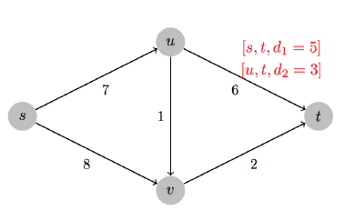

# 计算机算法设计与分析-作业4(LP)

- Author: hrwhipser
- https://github.com/hrwhisper/algorithm_course/


## 2. Airplane Landing Problem

> With human lives at stake, an air traffic controller has to schedule the airplanes that are landing at an airport in order to avoid airplane collision. Each airplane i has a time window [si,ti] during which it can safely land. You must compute the exact time of landing for each airplane that respects these time windows. Furthermore, the airplane landings should be stretched out as much as possible so that the minimum time gap between successive landings is as large as possible.
> For example, if the time window of landing three airplanes are [10:00-11:00], [11:20-11:40], [12:00-12:20], and they land at 10:00, 11:20, 12:20 respectively, then the smallest gap is 60 minutes, which occurs between the last two airplanes.
> Given n time windows, denoted as [s1,t1],[s2,t2],···,[sn,tn] satisfying s1 < t1 < s2 < t2 < ··· < sn < tn, you are required to give the exact landing time of each airplane, in which the smallest gap between successive landings is maximized.
> Please formulate this problem as an LP, construct an instance and use GLPK or Gurobi or other similar tools to solve it.

依题意，设xi为第i个时间窗的时间，y为各个x的之差最小值，因此有：
$$
\begin{alignat}{2}

\max\quad &y&  \\

\mbox{s.t.}\quad

&x_i-x_{i-1}\geq{y}, &\quad&i=2,...,n\\ 
&s_i\leq{x_i}\leq{t_i}, &\quad&i=1,...,n\\ 
&s_1<t_1<...<s_n<t_n &\quad&\\
\end{alignat}
$$

构建的例子：

三个航班，分别为[00:00-00:40],[00:40-01:10],[01:40-02:00]

用GPLK算得，三个航班的时间为00:00, 1:00, 2:00, 间隔为60分钟


## 3. Interval Scheduling Problem 

> A teaching building has m classrooms in total, and n courses are trying to use them. Each course i (i = 1, 2, …… , n) only uses one classroom during time interval [S~i~ , F~i~) (F~i~ > S~i~ > 0). Considering any two courses can not be carried on in a same classroom at any time, you have to select as many courses as possible and arrange them without any time collision. For simplicity, suppose 2n elements in the set {S~1~ , F~1~ ,......, S~n~,F~n~ } are all different.
>
> 1. Please use ILP to solve this problem, then construct an instance and use GLPK or Gurobi or other similar tools to solve it.
>
> 2. If you relax the integral constraints and change ILP to an LP (e.g. change x ∈ {0,1} to 0 ⩽ x ⩽ 1), will solution of the LP contains only integers, regardless of values of all S~i~ and F~i~ ? If it's true, prove it; if it's false, give a counter example. You can use the following lemma for help. 
>
>    LEMMA If matrix A has only 0, +1 or -1 entries, and each column of A has at most one +1 entry and at most one -1 entry. In addtion, the vector b has only integral entries. Then the vertex of polytope { x |Ax ⩽ b ,x ⩾ 0} contains only integral entries.

设首先将课程按F~i~ 进行排序 , x~ij~ 为1就是课程i 安排在教室j，则有:
$$
\begin{array}{rrrl}
 \max &\sum_{i=1}^{n}\sum_{j=1}^{m} x_{ij} && \\
 s.t. 
 &\sum_{j=1}^{m}x_{ij} &\le & 1 ,&i=1..n\\
 &F_i (x_{ij}+x_{kj} - 1) &\leq &S_k ,& 0 <i<k\leq n \quad j= 1..m \\
 & x_{ij}  &=& 0/1&i=1..n, \quad j= 1..m \\
\end{array}\nonumber
$$
对于第一个约束，保证了一门课只安排在一间教室

第二个约束为：若两门课安排在同一个教室，则它们时间不能冲突。当 x~ij~ =  x~kj~ = 1时，说明课程i和课程j 被安排在同一间教室，它们课程不能冲突，说明F~i~ <= S~k~ 。 若两者不全为1时（全为0或一个为1）,显然满足条件。


## 4. Gas Station Placement

>Let’s consider a long, quiet country road with towns scattered very sparsely along it. Sinopec, largest oil refiner in China, wants to place gas stations along the road. Each gas station is assigned to a nearby town, and the distance between any two gas stations being as small as possible. Suppose there are n towns with distances from one endpoint of the road being  d~1~ , d~2~ , ··· , d~n~ . n gas stations are to be placed along the road, one station for one town. Besides, each station is at most r far away from its correspond town. d~1~ , d~2~ , ··· , d~n~  and r have been given and satisfied  d~1~ < d~2~ < ··· <d~n~, 0 < r < d~1~ and d~i~ + r < d~i+1~ − r for all i. The objective is to find the optimal placement such that the maximal distance between two successive gas stations is minimized.
>Please formulate this problem as an LP.

依题意，设xi为第i个加油站的位置，y为各个x的之差最大值，因此有：
$$
\begin{alignat}{2}

\min\quad &y& \\

\mbox{s.t.}\quad

&x_i-x_{i-1}\leq{y}, &\quad&i=2,...,n\\ 
&d_{i} - r\leq{x_i}\leq{d_i} +r, &\quad&i=1,...,n\\ 
&d_1<d_2<...<d_n &\quad&\\
&0<r<d_1 &\quad&\\
&d_i + r <d_{i+1} - r  , &\quad&i=1,...,n-1\\ 
\end{alignat}
$$

一个例子：

4个城镇，d1 = 4, d2 = 10, d3 = 19, d4 = 30, r= 2

得：x1 = 4 , x2 = 12, x3 =20 ,x4 = 28,  最大的距离为8


## 5. Stable Matching Problem

> n men (m~1~,m~2~,  .... m~n~) and n women (w~1~,w~2~ ... ,w~n~), where each person has ranked all members of the opposite gender, have to make pairs. You need to give a stable matching of the men and women such that there is no unstable pair. Please choose one of the two following known conditions, formulate the problem as an ILP (hint: Problem 1.1 in this assignment), construct an instance and use GLPK or Gurobi or other similar tools to solve it.
>
> 1. You have known that for every two possible pairs (man m~i~ and woman w~j~ , man m~k~ and woman w~l~ ), whether they are stable or not. If they are stable, then S~i,j,k,l~= 1; if not,  S~i,j,k,l~= 0(i,j,k,l ∈ {1,2,...,n})
> 2. You have known that for every man m~i~, whether m~i~ likes woman w~j~ more than w~k~. If he does, then p~i,j,k~ = 1; if not, p~i,j,k~ = 0. Similarly, if woman w~i~ likes man m~j~ more than m~k~, then  q~i,j,k~ = 1, els q~i,j,k~ = 0.(i,j,k, ∈ {1,2,...,n})

### 1.

设x~ij~ = 1为 男i和女j配对，否则x~ij~ = 0

则有：
$$
\begin{array}{rrrl}
 \max &\sum_{i=1}^{n}\sum_{j=1}^{n} x_{ij} && \\
 s.t. 
 &\sum_{i=1}^{n}x_{ij} &= & 1 ,&j=1..n\\
  &\sum_{j=1}^{n}x_{ij} &= & 1 ,&i=1..n\\
 &x_{ij}+x_{kl} &\leq & S_{ijkl}+1 ,&  i,j,k,l = 1..n \quad i \ne k \quad j\ne l\\
 & x_{ij}  &=& 0/1&i,j=1..n \\
\end{array}\nonumber
$$

第一个和第二个约束限制了只能一男一女配对

第三个约束限制了若i和j有边且k和l有边，那么应该是稳定的边。

### 2.

设x~ij~ = 1为 男i和女j配对，否则x~ij~ = 0
$$
\begin{array}{rrrl}
 \max &\sum_{i=1}^{n}\sum_{j=1}^{n} x_{ij} && \\
 s.t. 
 &\sum_{i=1}^{n}x_{ij} &= & 1 ,&j=1..n\\
  &\sum_{j=1}^{n}x_{ij} &= & 1 ,&i=1..n\\
 &x_{ij}+x_{kl} &\leq &  3 - p_{ilj} -q_{lik} &i,j,k,l = 1..n \quad i \ne k \quad j\ne l\\
 & x_{ij}  &=& 0/1&i,j=1..n \\
\end{array}\nonumber
$$
前两个条件与之前的一致

第三个条件说明当$ p_{ilj} =  q_{lik} = 1$时，说明男i相比女j来说更喜欢女l，女l相比男k更喜欢男i，因此不该是x~ij~、x~kl~配对。


## 6. Duality

> Please write the dual problem of the MultiCommodityFlow problem in Lec8.pdf, and give an explanation of the dual variables. Please also construct an instance, and try to solve both primal and dual problem using GLPK or Gurobi or other similar tools.

原始问题：


$$
\begin{array}{rrrl}
 \max &0 && \\
 s.t. 
&\sum_{i=1}^{k}f_{i}(u,v) & \le & C(u,v) & for \quad each (u,v)\\
&\sum_{v,(u,v)\in E}f_{i}(u,v) - \sum_{v,(v,u)\in E}f_{i}(v,u) & = & 0 & for \quad each\quad i,v \in V -\{s_i,t_i\}\\
&\sum_{v,(s_i,v)\in E}f_{i}(s_i,v) - \sum_{v,(v,s_i)\in E}f_{i}(v,s_i) & = &d_i & for \quad each \quad i\\
&f_i(u,v) & \ge & 0 &for \quad each \quad i,(u,v)\\
\end{array}\nonumber
$$


## 7. Simplex Algorithm

>Please implement simplex algorithm or dual simplex algorithm with your favorite language, and make comparison with GLPK or Gurobi or other similar tools.

单纯形算法详解： 

- https://www.hrwhisper.me/introduction-to-simplex-algorithm/

代码如下：

```python
import numpy as np

class Simplex(object):
    def __init__(self, obj):
        self.mat = np.array([[0] + obj])

    def add_constraint(self, a, b):
        self.mat = np.vstack([self.mat, [b] + a])

    def solve(self):
        n = len(self.mat) - 1  # the number slack variables we should add
        temp = np.vstack([np.zeros((1, n)), np.eye(n)])  # add a diagonal array
        mat = self.mat = np.hstack([self.mat, temp])  # combine them!
        while mat[0].min() < 0:
            col = mat[0].argmin()
            row = np.array([mat[i][0] / mat[i][col] if mat[i][col] > 0 else 0x7fffffff for i in
                            range(1, mat.shape[0])]).argmin() + 1  # find the theta index
            if mat[row][col] <= 0: return None  # no answer. it equals the theta is ∞
            mat[row] /= mat[row][col]
            # for each i!= row do : mat[i] = mat[i] - mat[row] * mat[i][col]
            mat[np.arange(mat.shape[0]) != row] -= \
                mat[row] * mat[np.arange(mat.shape[0]) != row, col:col + 1]
        return mat[0][0]
```

使用例子

```python
if __name__ == '__main__':
    """
         maximize z: 3*x1 + 2*x2;
            2*x1 + x2 <= 100;
            x1 + x2 <= 80;
            x1 <= 40
            answer :180
    """
    s = Simplex([-3, -2])
    s.add_constraint([2, 1], 100)
    s.add_constraint([1, 1], 80)
    s.add_constraint([1, 0], 40)
    print(s.solve())
```

结果：

z = 180
