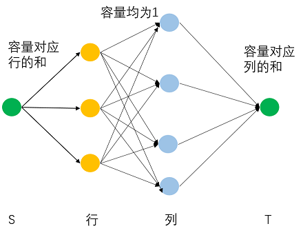
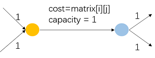

# 计算机算法设计与分析-作业5(NF)

- Author: hrwhipser
- https://github.com/hrwhisper/algorithm_course/


## 1. Load balance

> You have some different computers and jobs. For each job, it can only be done on one of two specified computers. The load of a computer is the number of jobs which have been done on the computer. Give the number of jobs and two computer ID for each job. You task is to minimize the max load.
> (hint: binary search)

### 基本思路

题目给定的数据中，有m个任务和n台PC，每个任务a可以由2台PC x和y来做，我们可以把任务a和对应的pc x,y建立连边（容量为1），然后建立一个超级源点S指向m个任务（这就有m条有向边，然后每条边的容量为1），然后把n台PC连接向一个超级汇点T，它们的容量为z。

z是什么呢？我们可以设为n台中负载最大的PC，而题目要求我们要最小化负载最大的值，我们可以二分搜索来“猜测”最小可行的z，而显然z的范围为[1,m]，这样可以运行log(m)次最大流就可以得到答案。

建立的图如下：


### 正确性证明

在上面阐述了如何建立这个网络流的图模型。

首先，z为PC到T的容量上限，这个值也就限制了我们的最大负载是多少，换句话说，PC的最大负载不能超过z。

而我们用二分搜索来猜测z的值，然后运行最大流。若T能收到的流为m，说明我们这个z是偏大的，我们可以继续缩小它，若不能收到m，说明负载要大于z。因此，我们的算法没有问题。

### 伪代码

```python
def min_load():
    for each task:
      add edge with capacity 1 to the two PC which can solve them.
    add a node s and t
    add edge from s to each task with capacity 1
    L = 1, R = m + 1 # m is the task
    add edge from each PC to t with capacity (L+R) / 2
    while L < R:
        mid = (L+R) / 2
        change capacity (all edge from PC to t) to mid
        if max_flow(s,t) == m: 
            R = mid
        else:
            L = mid + 1
    return L
```

### 时间复杂度

上面的过程中，需要log(m)次最大流的时间，而最大流的时间取决于所采用的最大流算法。

如用Dinitz算法的话，总时间复杂度就是$O(log(m)N^2M)$ , N为节点的数量，本题为m+n+2，M为边数，本题为m+2m+n


## 2. Matrix

> For a matrix filled with 0 and 1, you know the sum of every row and column. You are asked to give such a matrix which satisfys the conditions.

### 基本思路

每一行作为结点，这样有m个行结点，然后每一列也作为结点，这样有n个列结点。

建图，建立一个超级源点s指向m个行结点，容量为对应行的和，然后把m个行结点和n个列结点相连（每个都要，一共m*n条），容量为1，最后，把n个列结点连接到汇点t，而容量为对应的列的和。

然后跑最大流算法。当最大流算法结束后，若原问题有解（当然这题貌似保证有解），所得的最大流必等于之前各行的和等于之前各列的和。

在跑完最大流算法后，设行结点i到达列结点j的边的容量为x,那么矩阵matrix\[i][j] 的值就是1-x。



### 正确性证明

我们建立了一个超级源点，并和其行组成的点建立连边，且边的容量就是其对应行的和row[i]，这样保证了各行最大流量不会超过row[i]，且若原问题有解，这些边一定是满流的，这样才能使得总和相等。

接着，将行的点和列组成的点建立连边（一共m*n条），容量为1，就是该矩阵最大的取值，就是限制了从一行流向对某列的值最多为1. 这样建立连边也相当于若原矩阵a\[i][j] = 1,那么第i行会向第j列贡献1。

然后各列向汇点建立连边，容量为对应的列的和col[j]，这样限制了列的最大值（也就是流量）不超过col[j]。

因此，若最后都是流量等于之前各行以及各列和，原问题有解。且matrix\[i][j]的值就是从第i行流向第j列的流量（也等于1-该边的容量）

### 伪代码

```python
def test(m, n, row, col):
    s = 0
    t = m + n + 1
    for i in range(1, m + 1):  # link source s to [1,m]
        add_edge(0, i, row[i - 1])
        for j in range(m + 1, m + n + 1):  # row link to column
            add_edge(i, j, 1)

    for i in range(m + 1, m + n + 1):
        add_edge(i, t, col[i - m - 1]) # link column to sink t

    max_flow(m, n, s, t)

    matrix = [[0 for _ in range(n)] for _ in range(m)]
    for i in range(1, m + 1):
        for edge in g[i]:
            if edge.to != 0:
                matrix[i - 1][edge.to - m - 1] = 1 - edge.cap
    return matrix
```

### 时间复杂度

本题时间复杂度就是其最大流的时间。

如用Dinitz的话，最大流的时间为$O(N^2M)$ ，本题$N=m+n+2, M = m+mn+n$ 


## 3. Unique Cut

> Let $G = (V, E)$ be a directed graph, with source $s \in V$ , sink $t \in V$ , and nonnegative edge capacities $c_e$. Give a polynomial-time algorithm to decide whether $G$ has a unique minimum $s − t$ cut.

### 基本思路

首先跑一次最大流算法，然后就得到了最小割C, 以及对应C中的边E，设C的大小为|C|。

遍历E中的边，重复下述的过程：

- 对于当前的边e~i~，将其容量+1
- 继续运行最大流算法，得到新的最小割 C~i~ ， 其大小(即最大流流量)为|C~i~|
- 若|C~i~| = |C|, 说明|C~i~| 也是最小割，就是说G的最小割不唯一，return False
- 恢复e~i~ 的值

设图有m条边，该算法最多执行m+1次最大流算法，因此是多项式时间。

### 正确性证明

若有另一个最小割D,显然，至少会有一条边$e_i \notin D$, 那么增大e~i~的容量并不会使得新图中的最小割 > |C|，而会相等，因此若计算过程中|C~i~| = |C|，就说明了不唯一

### 伪代码

```python
def is_mincut_unique(g):
    E,flow = Max_flow(g) # E is the edge of min-cut, and flow is |C|
    for edge in E:
        edge.cap += 1
        E2,flow2 = Max_flow(g)
        if flow == flow2: return False
        edge.cap -=1
	return True
```

### 时间复杂度

前面分析出本题最多执行m+1次最大流算法，因此总的时间复杂度为$O((m+1)n^2m)$ 


## 4. Problem Reduction

> There is a matrix with numbers which means the cost when you walk through this point. you are asked to walk through the matrix from the top left point to the right bottom point and then return to the top left point with the minimal cost. Note that when you walk from the top to the bottom you can just walk to the **right or bottom point** and when you return, you can just walk to the top or left point. And each point CAN NOT be walked through more than once.

### 基本思路

给的矩阵已经给定了所需要的花费，因此我们只需要建图，建图方法为：

首先把矩阵中每个点和其右边、下方的两个点建立连边（容量为1，费用为0），然后对于每个元素，拆分成两个结点，以matrix\[i][j]为例,拆分成两个结点a和b，他们之间的连边为容量1（左上角和右下角的两个拆分容量为2），费用就是matrix\[i][j]。如下图



而题目从左上角到右下角，然后从右下角再到左上角的最小花费等价于从左上角到右下角走两次的最小花费。因此，相当于**流为2的最小费用流**。

### 正确性证明

首先建图的时候，只向右边、下方的两个点建立容量为1的边，保证了方向是向右或者向下的，且容量为1保证只走一次。

接着把点进行拆分为两个，由于这两个点之间的边的容量为1，因此，它们不会被重复走。而对于左上角和右下角的两个点，我们拆分的两个点的容量为2，因为要出发和到达2次。

拆分时两个结点边的花费就是对应点的权重，代表了走这条路的费用。

然后从走到右下角在返回左上角，其实和再次从左上角到右下角是一样的，因此，我们在左上角s求到右下角t流为2的最小费用流算法即可。

上述过程和题目的要求一致，因此正确。

### 伪代码

```python
build_graph_from_matrix(matrix) # 根据上面的方法建图
solve_min_cost_flow(2) #求最流为2的最小费用流
```

### 时间复杂度

前面分析出本题求流为2的最小费用流，因此若用Bellman_Ford求最短路，时间复杂度为O(2VE)也就是O(VE)；如果采用二叉堆的 Dijkstra，时间复杂度为O(2ElogV)也就是O(ElogV)。


## 5. Network Cost

> For a network, there is one source and one sink. Every edge is directed and has two value c and a. c means the maximum flow of the adge. a is a coefficient number which means that if the flow of the edge is x, the cost is ax^2^.
> Design an algorithm to get the Minimum Cost Maximum Flow.

### 基本思路

本题因为经过边的流量和产生的费用挂钩，为ax^2^，因此不能简单的采用最小费用最大流。

但是建图过程中我们可以将其关系“解绑”，比如c=7建图如下：


其实就是把原来的边拆分成多条，容量均为1，各边的花费为1a,3a......13a.

扩展为原图容量为n，那么拆成n条容量为1的边，各边花费为1a,3a....(2n-1)a

然后求最小费用最大流即可。

### 正确性证明

要证明此题的正确性，只要证明两个图等价，且原图可以被转化为新的图。

先证明两个图等价：

以上面的C=7的情况为例，由于求的是最小费用，因此有：

1. f = 1,  那么走1a
2. f = 2,  那么走1a + 3a = a*2^2^ = 4a
3. f = 3,  那么走1a + 3a + 5a = a*3^2^ = 9a
4. f = 4,  那么走1a + 3a + 5a + 7a = a*4^2^ = 16a
5. f = 5,  那么走1a + 3a + 5a + 7a +9a  = a*5^2^ = 25a
6. f = 6,  那么走1a + 3a + 5a + 7a +9a  + 11a = a*6^2^ = 36a
7. f = 7,  那么走1a + 3a + 5a + 7a +9a  +11a + 13a = a*7^2^ = 49a

可以看到，其实是我们的平方被变成了奇数的和。

若**任意的平方能由为奇数的相加表示**，那么我们就能证明两个图等价，且原图可以转化为新的图（原来的平方用奇数和表示了）

而这是显然的，原来的容量为n，我们拆分为1a,.....,(2n-1)a的n条边，我们有：
$$
\begin{array}{c}
	1a + 2a + ...(2n-1)a =& \frac{(1 + 2n-1)n}{2}a = &n^2a\\
	
	
\end{array} \nonumber
$$
而任意的流f <= n，也能被表示，因此上面的建图正确。

### 伪代码

```python
build_graph_from_matrix(matrix) # 根据上面的方法建图
solve_min_cost_max_flow() #求最小费用最大流
```

### 时间复杂度

若用Bellman_Ford求最短路，时间复杂度为O(FVE)

若采用二叉堆的 Dijkstra，时间复杂度为O(FElogV)。


## 7. Maximum flow

>Another way to formulate the maximum-flow problem as a linear program is via flow decomposition. Suppose we consider all (exponentially many) s-t paths p in the network G, and let f~p~ be the amount of flow on path p. Then maximum flow says to find
>$$
>\begin{array}{rrrrrr}
> \max & z & = &\sum{f_p}   & & \\
> s.t. &  \sum_{e \in p}f_p  & \leq & u_e ,& for \quad all \quad edge \quad e &   \\
>      & f_p  & \geq & 0  & &  \\
>\end{array} \nonumber
>$$
>(The first constraint says that the total flow on all paths through e must be less than u~e~.) Take the dual of this linear program and give an English explanation of the objective and constraints.

The dual of this program has the form as follows:
$$
\begin{array}{r}
 \min &   \sum_{e \in E}{u_ey_{e}}   & \\
 s.t. &  \sum_{e  \in p}y_{e}  & \geq & 1 ,& for \quad all \quad path \quad p &   \\
      & y_{e}  & \geq & 0  & &  \\
\end{array} \nonumber
$$
We add a 'weight'  which is called y~e~ for every edge. 

The two constraints says every path has a non-negative weight and sum of  every path's weight must be at least 1. Actually, given a cut A-B(and $s \in A, t\in B$) ,  if  edge e connect A and B(in other words,  $u \in A, v\in B\quad(u,v) $ is two vertices of edge e，and $ (u,v)$ is  a cut edge ),we set  y~e~ = 1, otherwise, we set y~e~ = 0.

So, the objective function is just to minimize the sum of capacity multiply its weight. Obviously, it is designed  to solve the minimum cut problem.

目标函数中 $y_e$ 表示一条边选或者不选，为1选，为0不选，因此目标函数是求最小割。

第一个约束条件表示从s到t中的路径，至少有一条边在割上。


## 8. Ford-Fulkerson algorithm

> Implement Ford-Fulkerson algorithm to find the maximum flow of the following network, and list your intermediate steps. Use you implementation to solve problem 1 and show your answers.
> INPUT: (N, M) means number of jobs and computers. Next N line, each line has two computer ID for a job. see more detial in the file problem1.data.
> OUTPUT: the minimum number of the max load.

```C++
import collections
import copy


class Edge(object):
    def __init__(self, to, cap, rev):
        self.to = to
        self.cap = cap
        self.rev = rev


def add_edge(from_, to, cap):
    g[from_].append(Edge(to, cap, len(g[to])))
    g[to].append(Edge(from_, 0, len(g[from_]) - 1))


def dfs(s, t, flow, vis):
    if s == t: return flow
    vis[s] = True
    for edge in g[s]:
        if not vis[edge.to] and edge.cap > 0:
            f = dfs(edge.to, t, min(flow, edge.cap), vis)
            if f:
                edge.cap -= f
                g[edge.to][edge.rev].cap += f
                return f
    return 0


def max_flow(m, n, s, t):
    flow = 0
    while True:
        vis = [False] * (m + n + 2)
        f = dfs(s, t, 0x7fffffff, vis)
        if not f: return flow
        flow += f


g = collections.defaultdict(list)


def test():
    with open('./problem1.data', 'r') as f:
        for i in range(3):
            f.readline()

        lines = f.read().split('\n')[::-1]
        while lines:
            global g
            g = collections.defaultdict(list)
            line = lines.pop().strip()
            if line == '': continue
            m, n = list(map(int, line.split(' ')))
            s, t = n + m, n + m + 1
            for i in range(m):
                x, y = list(map(int, lines.pop().strip().split(' ')))
                add_edge(i, x + m - 1, 1)
                add_edge(i, y + m - 1, 1)
                add_edge(s, i, 1)
            print(binary_search(m, n, s, t))


def binary_search(m, n, s, t):
    L, R = 1, m + 1
    global g
    g2 = copy.deepcopy(g)
    while L < R:
        mid = (L + R) >> 1
        for i in range(m, m + n):
            add_edge(i, t, mid)

        if max_flow(m, n, s, t) == m:
            R = mid
        else:
            L = mid + 1
        g = copy.deepcopy(g2)
    return L


if __name__ == '__main__':
    test()
```

结果

```
2
1
2
3
1
1
3
1
1
1
```


## 9. Push-relabel

> Implement push-relabel algorithm to find the maximum flow of a network, and list your intermediate steps. Use your implementation to solve problem 2 and write a check problem to see if your answer is right.
> INPUT: Numbers of rows and columns. And the sum of them. See more detail in the file problem2.data.
> OUTPUT: The matrix you get. Any one satisfy the conditions will be accept.


```python
import collections


class Edge(object):
    def __init__(self, to, cap, rev):
        self.to = to
        self.cap = cap
        self.rev = rev


class Vertex(object):
    def __init__(self, id_, flow):
        self.id = id_
        self.flow = flow


def add_edge(from_, to, cap):
    g[from_].append(Edge(to, cap, len(g[to])))
    g[to].append(Edge(from_, 0, len(g[from_]) - 1))


def found_vertex_non_zero(n, nodes):
    for i in range(n - 1):
        if nodes[i].flow > 0: return i
    return -1


def max_flow(m, n, s, t):
    N = m + n + 2
    h = [0] * N
    nodes = [Vertex(i, 0) for i in range(N)]
    h[s] = N
    for edge in g[s]:
        g[edge.to][edge.rev].cap += edge.cap
        nodes[edge.to].flow = edge.cap
        edge.cap = 0

    while True:
        cur = found_vertex_non_zero(N, nodes)
        if cur == -1:  break

        found = False
        for edge in g[cur]:
            if edge.cap > 0 and h[cur] > h[edge.to]:
                found = True
                f = min(nodes[cur].flow, edge.cap)
                edge.cap -= f
                g[edge.to][edge.rev].cap += f
                nodes[cur].flow -= f
                nodes[edge.to].flow += f
                if nodes[cur].flow == 0:
                    break
        if not found:
            h[cur] += 1
    return nodes[-1].flow


g = collections.defaultdict(list)


def test(row, col):
    global g
    g = collections.defaultdict(list)

    m = len(row)
    n = len(col)
    s = 0
    t = m + n + 1
    for i in range(1, m + 1):  # link source s to [1,m]
        add_edge(0, i, row[i - 1])
        for j in range(m + 1, m + n + 1):  # row link to column
            add_edge(i, j, 1)

    for i in range(m + 1, m + n + 1):
        add_edge(i, t, col[i - m - 1])  # link column to sink t

    print(max_flow(m, n, s, t), sum(row), sum(col))

    matrix = [[0 for _ in range(n)] for _ in range(m)]
    for i in range(1, m + 1):
        for edge in g[i]:
            if edge.to != 0:
                matrix[i - 1][edge.to - m - 1] = 1 - edge.cap

    print(is_correct(row, col, matrix))
    return matrix


def is_correct(row, col, matrix):
    import numpy as np
    row_1 = np.sum(matrix, axis=1).tolist()
    col_1 = np.sum(matrix, axis=0).tolist()
    return row_1 == row and col_1 == col


if __name__ == '__main__':
    # test()
    with open('./problem2.data') as f, open('./2.out', 'w+') as fw:
        for i in range(3):
            f.readline()

        lines = f.read().split('\n')[::-1]
        while lines:
            line = lines.pop().strip()
            if line == '': break
            m, n = line.split(' ')
            row = list(map(int, lines.pop().strip().split(' ')))
            col = list(map(int, lines.pop().strip().split(' ')))
            matrix = test(row, col)
            for row in matrix:
                for x in row:
                    fw.write(str(x) + ' ')
                fw.write('\n')
            fw.write('\n\n')
```

